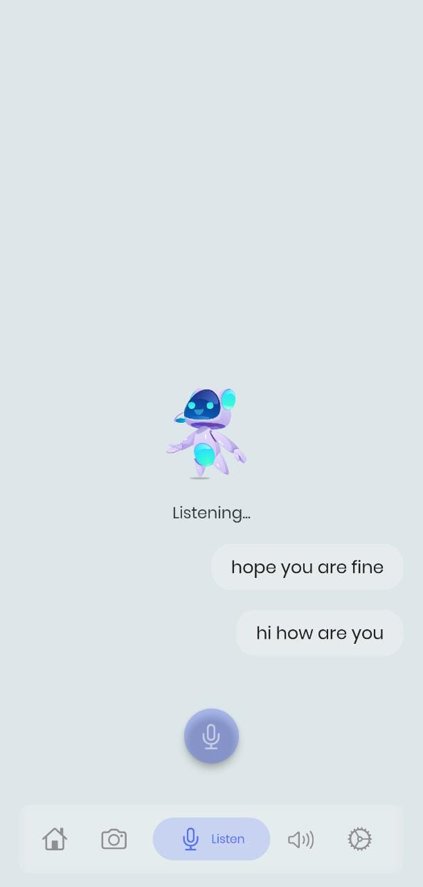

# Illusion v1.0

## Introduction

_Illusion: Mobile Application for Differently Abled_ was developed as part of the Mini Project course under Kerala Technological University. The inspiration behind taking up this particular topic was after researching about the problems faced by the blind people in our country. Our aim was to build a mobile application for a social cause. Hence, the idea of _Illusion_ was formulated.

## Product
The product is a culmination of various ideas. It is an all-in-one app that targets the disabled individuals. The primary users of _Illusion_ are categorised into three:
1. Visually-impaired users
2. Speechless users
3. Hearing-impaired users

## Features

- Object detection
- Text to speech
- Speech to text
- Voice assistant
- Dark mode

## How to use

Home-page acts as the common page from which the user directs the control to any other tab. The home-page takes the user to four different tabs namely: Help me see, Help me speak, Help me hear and Settings.

Help me see tab helps in detecting objects at a particular distance and warn the user about it. This feature mainly helps the blind users. It allows them to detect objects within a certain parameter.
There is also a voice assistant feature that is kept ON by default when the user opens the application for the first time. It works on the basis of a few commands to navigate between the tabs.

Help me speak tab is used for text to speech conversion. The English language is used for conversation. This feature mainly targets to help the mute population.

Help me hear tab is used to convert English speech to text. The conversion works for English language and thus English words or sounds are converted to text.

## Requirements

- Works on all Android phones
- Android API level should be above 21
- Must require a good microphone, speaker and camera
- Does not require Internet connectivity

## Screenshots

  
  
  

## The team

This project helped us to develop a spirit of teamwork and work towards the well-being of the society. It made us understand the problems faced by the differently abled population and the need to empower them by making them independent and self-confident.
